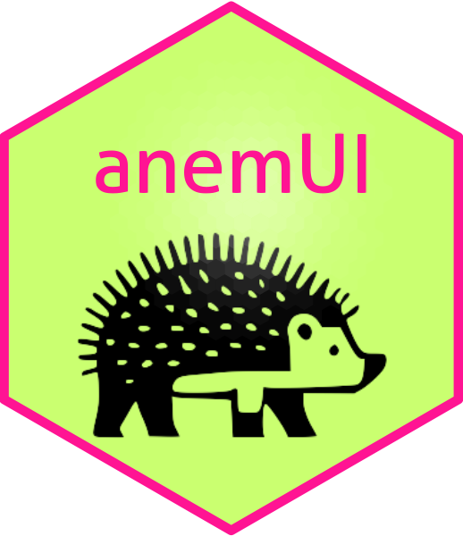

#  AnemUI

## Summary

AnemUI Framework, containing the code to generate prototype interactive web climate services tools.


## Publicacion en GitHub Repo
```
#npm login --scope=@lcsc --registry=https://npm.pkg.github.com
npm login --scope=@lcsc --registry=https://mirror.lcsc.csic.es/repository/anemui/
# user: anemui
# pw: la misma que la wiki
npm publish --workspaces --if-present
```


## Develop Core en Visor
Pasos para desarrollar el Core usando un visor que no sea la demo. 
Estos pasos presuponemos que **no** hay una rama en este repositorio

Ejecutar en el visor (con node_modules funcionando):

```
# Se supone que node_modules ya esta sino ejecutar:
# npm i
rm -r node_modules/@lcsc
git clone git@github.com:lcsc/AnemUI.git node_modules/@lcsc

# Si hay una rama añadir -b <rama_del_core>
ln -s node_modules/@lcsc AnemUI

# Creamos la rama, omitir si ya esta en una rama
git -C AnemUI checkout -b <rama_core>
git -C AnemUI push -u origin <rama_core>
# Repetimos en el visor y creamos la misma rama
git checkout -b <rama_core>
git push -u origin <rama_core>

```

A partir de aqui se puede desarrollar como siempre
