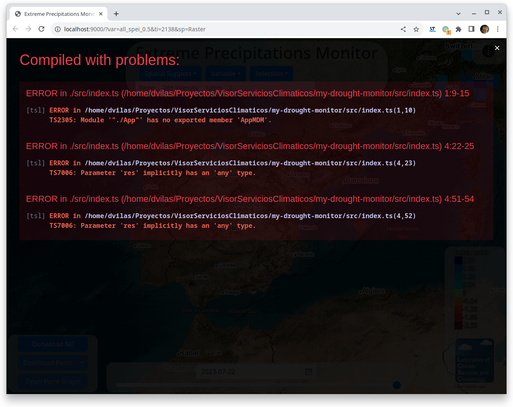

= Guia Rapida

En esta parte explicamos como empezar a desarrollar un visor, empezando por visualizar el visor de precipitaciones extremas y luego creando uno nuevo de ejemplo.

== PreRequisitos
* Tener bajado el codigo en una carpeta como por ejemplo `VisorServiciosClimaticos` (la que se crea con `git clone`)
* Tener los artefactos de un NetCDF publicados bajo una url comun
** Se puede usar la ruta a un visor conocido como https://lisuarte.eead.csic.es/etm-proto1/[Monitor Temperaturas Extremas]

== Instalacion de Node.JS
Node.JS puede ser instalado directamente desde su pagina web o desde el repositorio de la distribucion, pero recomendamos usar https://github.com/nvm-sh/nvm[Node Version Manager]. Disponible para plataformas Posix (Linux/Mac)

[sidebar]
****
NOTE: Para windows existe el mismo comando, que se puede instalar https://github.com/coreybutler/nvm-windows
****

Para instalar `nvm` solo hay que ejecutar el auto instalador

.Instalacion de nvm
[source,console]
----
$ curl -o- https://raw.githubusercontent.com/nvm-sh/nvm/v0.39.4/install.sh | bash
$ echo 'export NVM_DIR="$([ -z "${XDG_CONFIG_HOME-}" ] && printf %s "${HOME}/.nvm" || printf %s "${XDG_CONFIG_HOME}/nvm")"
[ -s "$NVM_DIR/nvm.sh" ] && \. "$NVM_DIR/nvm.sh" # This loads nvm' >> ~/.bash_profile
$ source ~/.bash_profile
----

Con esto tendremos el gestor de versiones de node instaladas que nos facilitara seleccionar la version de node más adecuada, segun queramos. Con lo que procederemos a instalar la version 16 de node y actualizar npm a la ultima version.

.Instalacion de Node.JS 16
[source,console]
----
$ nvm install 16
$ nvm use 16
$ node -v
$ npm -v
$ npm install -g npm@latest
$ npm -v
----

== Visor de Precipitaciones Extremas

=== Primera Ejecuccion del visor de Precipitaciones Extremas
Para ejecutar el visor de Precipiataciones Extremas, debemos invocar el comando `dev` dentro del workspace `extreme-precipitation-monitor` con todas las depencias descargadas

.Primera ejecucion del visor
[source,console]
----
$ cd VisorServiciosClimaticos # <1>
$ npm install # <2>
$ npm -w extreme-precipitation-monitor run dev # <3>
----
<1> Nos situamos en el directorio
<2> Descargamos las depencias, solo es necesario la primera vez
<3> Ejecucion propiamente dicha

[sidebar]
****
NOTE: A partir del punto <2> solo sera necerario ejecutar `npm -w [visor] run [comando]` para lanzar el visor
****
Una vez lanzado se abrira una pagina web con el visor

[.text-center]
.Home del visor de Precipitaciones Extremas
image::images/SC-EP-home.png["Home Visor",align=center]

WebPack lanzara un pequeño servidor web, que estara sirviendo las paginas al vuelo. De tal forma que si se hace una modificacion en los ficheros que usa la applicacion, esta se recompilara y se recargara en el navegador. 

Ademas este servidor hace de proxy para suministrar los ficheros/artefactos de `NcWebMapper`

=== Creacion de ficheros publicables
Por ultimo generaremos la carpeta `dist` con los ficheros HTML, JS y similares que require la applicacion.

[source,console]
----
$ rm -rf extreme-precipitation-monitor/dist/ # <1>
$ npm -w extreme-precipitation-monitor run build # <2>
----
<1> borramos la carpeta, para asegurarnos que la cache se borra.
<2> lanzamos el comando `build` para generar la carpeta dist

El resultado seran todos los ficheros creados y que a su vez estene en la carpeta assets.

[.text-center]
.Contenidos Carpeta Dist
image::images/CarpetaDist.png["",align=center]

[sidebar]
****
WARNING: Ojo, estos ficheros requieren estar publicados en el mismo nivel que los artefactos generados por `NcWebMapper`. Los ficheros (como times.js, nc/...) son localizados de forma relativa. 
****

== Basic Drought Monitor
Ahora procederemos a crear un Visor nuevo, en este caso sera una version simplificada del Monitor de sequias, al que pondremos dos variables, por ejemplo `cotton_spei_0.5` y `soybean_spei_0.5`.

=== Duplicar Precipitaciones extremas
En este paso lo que haremos sera copiar la carpeta y modificar los ficheros necesarios para crear el nuevo visor.

[source,console]
----
$ cp -a extreme-precipitation-monitor my-drought-monitor
----

Lo siguiente es añadir `my-drough-monitor` a los workspaces de Node.JS modificando el fichero *`package.json` de la raiz*

[source,json]
.package.json
----
{
  "name": "cs-viewer",
  "version": "0.0.1",
  "description": "Climatic Services Viewer",
...
  "workspaces": [
    "core",
...    
    "extreme-temperature-monitor",
    "my-drought-monitor", <1>
    "evapotranspiration-monitor",
...
  ],
...
}
----
<1> Añadir esta linea y ojo con el formato JSON (comas y omitir el 1)

Una vez añadido al WorkSpace configuraremos el nuevo visor. Primeramente los atributos Node.JS, modificando el *`package.json` del proyecto: `my-drought-monitor/package.json`*

[source,json]
.my-drought-monitor/package.json
----
{
  "name": "mdm-monitor", <1>
  "version": "0.0.1",
  "description": "My Drought Monitor", <1>
... <2>
}
----
<1> Cambiar estas lineas
<2> El resto se pueden dejar igual.

Finalmente configuraremos la URL donde estan publicados los artefactos para que en desarrollo pueda localizarlos (proxy), esto se configura en el fichero de configuracion del visor `my-drought-monitor/csconfig.js`
[source,js]
.my-drought-monitor/csconfig.js
----
const path = require('path');
const distPath = path.resolve(__dirname, 'dist');

module.exports = {
    distPath: distPath,
    proxyDataUrl:"https://servicios-climaticos.pti-clima.csic.es/etm-proto1/" <1>
}
----
<1> URL donde estan los artefactos `NcWebMapper`, en este caso nos sirve esta

El resto de ficheros del raiz (`tsconfig.json` y `webpack.config.js` los dejamos tal y como estan.)

En este punto conviene lanzar este nuevo visor para aseguranos que todo sigue funcionando.

[source,console]
----
$ npm i # <1>
$ npm -w my-drought-monitor run dev # <2>
----
<1> actualizamos las dependencias para que npm cree un enlace al nuevo proyecto. Esto se debe ejectuar al menos una vez
<2> lanzamos la aplicacion

La applicacion la podemos dejar lanzada y asi ir viendo los cambios en vivo.

== Cambios en el nuevo monitor

Ahora ha llegado el momento de ir cambiando el monitor. Los pasos son:

. Cambiar el nombre de clase
. Cambiar el titulo
. Adaptar la fuente de datos

=== Nombre de Clase
Cambiaremos el nombre de la clase para evitar posibles colisiones de nombre. Modificaremos el fichero `my-drought-monitor/src/main.ts`

[source,ts]
.my-drought-monitor/src/index.ts
----
import { AppMDM } from "./App"; <1>
export const app=AppMDM.getInstance() <1>

app.configure().then((res)=>{app.render()}).catch((res)=>{console.error("error loading data...",res)})
----

En el momento de salvar este cambio, veremos como la applicacion se recarga y nos avisa del error (no hemos cambiado la definicion en `my-drought-monitor/src/App.ts`)

[.text-center]
.Error Nombre de Clase

Este error lo solucionaremos cambiando la definicion en el su codigo fuente: `my-drought-monitor/src/App.ts`

.my-drought-monitor/src/App.ts
[source,ts]
----
import {DataServiceApp, STR_ALL} from "cs-viewer-core/src/ServiceApp"
import {loadTimesJs} from "cs-viewer-core/src/data/CsDataLoader"    
import { EpmOptionsService, EpmService, SUBVAR_5DAY } from "./EpmService";
import { CategoryRangePainter, PaletteManager } from "cs-viewer-core/src/PaletteManager";
import { EpmInfo } from "./EmpInfo";

const VIEWER_NAME = "My Drought Monitor" <1>
export class AppMDM extends DataServiceApp{ <1>
    private static instance:AppMDM; <1>

    public static getInstance(): AppMDM { <2>
        if (!AppMDM.instance) {AppMDM
            AppMDM.instance = new AppMDM();
        }

        return AppMDM.instance;
    }
    
    private constructor(){
        super()
        this.service=new EpmService()
        this.optionsService=new EpmOptionsService()
        //this.infoDiv=new EpmInfo(this,"infoDiv") <3>
    }

    public async configure():Promise<AppMDM> { <1>
...
    }
}
----
<1> Esta linea esta cambiada
<2> Este metodo esta cambiado entero
<3> Esta linea configura el boton Info, se puede comentar

Con estos cambios ya compilara y se vera igual que el Monitor de Precipitaciones Extremas.

=== Configuración Minima
Al copiar de Monitor de precipitaciones nos hemos traido tambien codigo de personalizacion que no necesitamos, asi que cambiaremos las funciones 

.my-drought-monitor/src/App.ts
[source,ts]
----
...
export class AppMDM extends DataServiceApp{
...
        public async configure():Promise<AppMDM> { <1>
        
        let timesJs= await loadTimesJs();
        this.setTimesJs(timesJs,"tmax") <2>
        
        let vars = this.service.getVars()
        this.state.varName=vars[0];
        let selections=this.service.getSelections(this.state)
        this.state.selection=selections[0]
        this.state.selectionParamEnable=this.service.isSelectionParamEnabled(this.state)
        if(!this.state.selectionParamEnable)
            this.state.selectionParam=this.service.getSelectionParam(this.state)

        if(this.fillStateFromUrl()){
            console.log("State Loaded")
        }else{
            this.changeUrl();
        }
        
        this.getMenuBar().setTitle(VIEWER_NAME)
        this.getSideBar().setSupportValues(this.service.getRenderers())
        this.getSideBar().setVariables(vars)
        this.getSideBar().setSelection(selections);

        this.getGraph().setParams("Eventos Sequia" , 1, true); <3>

        //this.getDateSelectorFrame().setValidDates(timesJs.times[varId])

        return this;
    }

    public getLegendValues(): number[] { <1>
        const STEPS = 10;
        let state = this.getState();
        let timesJs = this.getTimesJs();
        let dateIndex = state.selectedTimeIndex;
        let varId = state.varId;
        let varMin = timesJs.varMin[varId][dateIndex];
        let varMax = timesJs.varMax[varId][dateIndex];
        let step = (varMax - varMin) / STEPS;
        let values = [];
        for (let i = 0; i < STEPS; i++)
            values.push(Math.round((varMin + i * step) * 100) / 100);
        
        return values;
    }

    <4>
    //public hasSubVars(): boolean  
    //public async filterValues(values: number[], t: number, varName: string): Promise<number[]> 
}
----
<1> Metodo a cambiar (copiar tal cual de esta pagina)
<2> Valor Inicial del nc a cargar
<3> Cambio de nombre del grafico
<4> Metodos que no son necesarios para el visor minimo

=== Cambio de la fuente de datos
Para simplificar un poco las cosas, hay un "servicio" (`EpmService`) que tiene toda la informacion necesaria con las variables, asi que cambiremos esta clase.

.my-drought-monitor/src/MdmService.ts
[source,ts]
----
import { CsDataService, STR_ALL, STR_CUSTOM } from "cs-viewer-core/src/ServiceApp";
import { CsViewerData } from "cs-viewer-core/src/data/CsDataTypes";
import { renderers } from "cs-viewer-core/src/tiles/Support";

const VAR_TMAX = "Temperatura Maxima";
const VAR_TMIN = "Temperatura Minina";
export class MdmService implements CsDataService {
    getSubVars(state: CsViewerData): string[] {
        return [];
    }

    public getRenderers(): string[] {
        return renderers
    }

    public getVars(): string[] {
        return [VAR_TMAX,VAR_TMIN]
    }
    public getSelections(state: CsViewerData): string[] {
        let ret: string[]
        switch (state.varName) {
            case VAR_TMAX:
                ret = [STR_ALL,"20ºC", "30ºC"]
                break;
            case VAR_TMIN:
                ret = [STR_ALL,"-10ºC", "0ºC"]
                break;
            default:
                ret = []
        }
        ret.push(STR_CUSTOM)
        
        return ret;
    }

    public getSelectionParam(state:CsViewerData):number{
        if(state.selection==STR_ALL) return 0;
        return parseFloat(state.selection);
    }

    public isSelectionParamEnabled(state:CsViewerData){
        return (STR_CUSTOM == state.selection)
    }

    public getVarId(state: CsViewerData): string {
        switch (state.varName) {
            case VAR_TMAX:
                return "tmax"
            default:
                return "tmin"
        }
    }
}

----

[sidebar]
****
NOTE: Esta clase es una copia de EpmService y crearemos el fichero `my-drought-monitor/src/MdmService.ts`

TIP: Podemos renombrar el fichero y modificar el codigo o crear el fichero nuevo

CAUTION: Se han escogio valores arbitrarios para mostar que cada variable puede tener su propia seleccion
****

Una vez que tengamos la fuente de datos preparada debemos instruir a la aplicacion de usar dicho servicio

.my-drought-monitor/src/App.ts
[source,ts]
----
import { MenuBar } from "cs-viewer-core/src/ui/MenuBar";
import {BaseApp} from "cs-viewer-core/src/BaseApp"
import {loadTimesJs} from "cs-viewer-core/src/data/CsDataLoader"    
import { renderers } from "cs-viewer-core/src/tiles/Support";
import { MdmService } from "./MdmService"; <1>

export class AppMDM extends BaseApp{ 
    private static instance:AppMDM; 
    private service:MdmService <1>
...    
    private constructor(){
        super()
        this.service=new MdmService() <1>
    }
...
}
----
<1> Linea a cambiar

[sidebar]
****
CAUTION: Es posible que de errores de compilacion hasta que no salvemos los dos ficheros
****