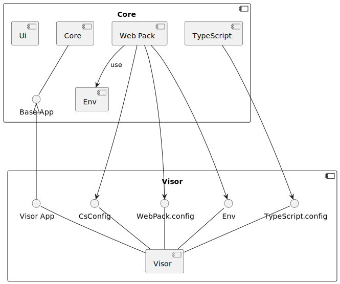

= Esqueleto de un Visor

La filosofia de este framework es que los visores proveean de la configuracion visual y que el codigo principal este en la libreria core.

Los Visores en principo deben ser más o menos iguales, salvo titulos y origenes de datos. Por ello deben tener una serie de ficheros de configuracion, utilizados por Typescript, Webpack,... Y ademas suministrar una clase para comunicarse con el core y asi los diferentes modulos puedan localizar la informacion desde los artefactos de NcWebMapper.

[.text-center]
.Componentes Vision General

== Ficheros de configuracion.
Como toda aplicacion Node con WebPack/TypeScript el visor requiere unos cuantos ficheros de configuración y a los cuales hemos añadido un sistema de `Environments` y un fichero de configuracion del propio visor.

=== Ficheros Basicos: Node + WebPack + TypeScript
Estos ficheros son los que configuran a nivel tecnico dichos sistemas. Inicialmente estos se copiaran de un visor ya existente y simplemente se personalizaran para el nuevo visor.

Pondremos aqui ejemplos del monitor de precipitaciones extremas.

[source,json]
.extreme-precipitation-monitor/package.json
----
{
  "name": "ep-monitor", <1>
  "version": "0.0.1",
  "description": "Extreme Precipitations Monitor", <2>
  "main": "src/index.ts", <3>
  "devDependencies": {}, <6>
  "scripts": { <4>
    "build": "webpack",
    "build-wms": "NODE_ENV=wms webpack",
    "watch": "webpack --watch",
    "start": "webpack serve --open",
    "dev": "NODE_ENV=development webpack serve --open",
    "dev-wms": "NODE_ENV=developmentWms webpack serve --open"
  },<5>
  "repository": {
    "type": "git",
    "url": "git+https://github.com/lcsc/VisorServiciosClimaticos.git"
  },
  "author": "LCSC",
  "license": "GPL-3.0",
  "bugs": {
    "url": "https://github.com/lcsc/VisorServiciosClimaticos/issues"
  },
  "homepage": "https://github.com/lcsc/VisorServiciosClimaticos#readme"
}

----
<1> Nombre del paquete, debe ser unico, recomendamos siglas seguidas de `-monitor` o lo que corresponda.
<2> Descripcion del visor acutal
<3> Este es fichero principal, lo dejaremos tal cual.
<4> Estos son los comandos disponibles para cada, para cada entorno debe existir al menos un build y un dev
<5> El resto de campos se debe dejar igual. 
<6> Las dependencias unicas al visor se pueden añadir, usando los comandos `npm` a necesidad.

[source,json]
.extreme-precipitation-monitor/tsconfig.json
----
include::../extreme-precipitation-monitor/tsconfig.json[]
----

Este Fichero configura el compilador de TypeScript, no es necesario tocarlo. En caso de necesidad se puede usar el del core.

[source,js]
.extreme-precipitation-monitor/webpack.config.js
----
include::../extreme-precipitation-monitor/webpack.config.js[]
----

Por ultimo este fichero configura WebPack, pero como se puede ver lo que hace es llamar al fichero de igual nombre del `core`. La version del core, utilizara el `environment` y el fichero `csconfig.js` para configurar WebPack para ejecutar el comando y generar el entregable.  

=== Enviroment
Los entornos o `environments` es un tema para un apartado completo. El resumen es que podemos tener diferentes variables por entorno y usarlas en el codigo. Estas variables si son `const` pueden ser usadas por el optimizador de codigo para poner o quitar codigo (como por ejemplo version `wms` o nuestro renderizador)

En general existira un fichero llamado `env.[environment].js` por cada entorno declarado en los commandos declarados en el `package.json`.

[source,js]
.core/env/env.wms.js
----
include::../core/env/env.wms.js[]
----

Como se puede ver, solo hay que exportar el objeto con los datos que necesitemos. Y ya veremos como acceder a ellos.

=== Configuracion del Visor
Por ultimo la forma de configurar el visor, basicamente variables que dependen del visor y no del entorno a generar.

[sidebar]
****
WARNING: De momento solo configura un par de cosas de webpack.
****

[source,js]
.extreme-precipitation-monitor/csconfig.js
----
const path = require('path');
const distPath = path.resolve(__dirname, 'dist');

module.exports = {
    distPath: distPath, <1>
    proxyDataUrl:"https://calculador11.ipe.csic.es/global-drought-crops/" <2>
}
----
<1> Directorio de salida
<2> Url usada en desarrollo para localizar los artefactos NcWebMapper

[sidebar]
****
NOTE: En desarrollo, cuando se ejecuta `npm -w [visor] run dev` (o similar), webpack lanza un servidor web (http://localhost:9000/index.html[]) y para acceder a los artefactos NcWebMapper se configura un proxy reverso. De esta forma el navegador puede localizar los ficheros generados por NcWebMapper en el raiz del servidor (ej: http://locahost:9000/times.js[])
****

== Proceso de Configuracion.
El proceso de configuracion se realiza en WebPack. Siguiendo el siguiente diagrama

[.text-center]
.Proceso Configuracion
image::media/ProcesoConfiguracion.svg[]["Proceso de Configuracion",align=center]

El proceso en grandes pasos es el siguiente

1. WebPack solicita la configuracion del modulo principal(el visor), que a su vez llama al core.
2. El core obtiene los datos de configuracion (`visor/csconfig.js`)
3. Posteriormente construye las variables del entorno
  a. Primero las propias del core
  b. Luego las del visor
  c. Por ultimo luego las junta usando la extension js (`...`). Esto lo que hace es que ademas unir, si el visor redefine un valor se queda este ultimo.
4. El siguiente paso es crear la configuracion base. Esta configuracion tiene todo el WebPack configurado para TypeScript, SCSS y generar los ficheros para `Producción`
  a. En la construccion del objeto se le injectan el directorio destino y el plugin de "Define" tener acceso a las variables de entorno
  b. En el mismo "Define" se incluyen las variables de configuracion para poder leerlas, en caso de ser necesario.
5. Por ultimo, si la variable que indica el entorno (`NODE_ENV`) es de Desarrollo, mediante la extension se añaden todos los campos que WebPack necesita para un entorno de desarrollo (incluir mapa de ficheros/codigo, no optimizar, configuracion del servidor...)
    a. como en caso anterior, en la construccion del objeto se inyecta la url donde estan los artefactos.

== Aplicacion 

Como hemos visto en el `package.json` el punto de entrada de la appliacion es el fichero `index.js`, dentro de la carpeta src.
Este codigo debe instanciar una clase que extienda BaseApp e implementar una serie de metodos para seguir el proceso general siguiente:

[.text-center]
.Componentes Vision General
image::media/Applicacion.svg["Proceso Aplicacion",align=center]

Como se ve el diagrama hay 3 grupos:
* App: son los objetos que debe proporcinar la applicacion
* Core: Son los objetos que proporciona el core (solo representado un resumen, para explicar)
* times.js: un ejemplo de un artefacto del `NcWebMapper`, necesario para la inicializacion.

La aplicacion como minimo debe tener un `*Index*` (invocado al iniciar) y una Clase `*VisorApp*` que extienda de `*BaseApp*`. Para facilitar la gestion de los mismos y disociar la funcionalidad de los datos a mostrar, se ha creado una clase `*DataService*` que se recomienda proporcionar tambien. 

[sidenote]
****
NOTE: Data service no es invocado por el `core`, pero permite relacionar opciones de la UI con las variables de los NetCDF. Y en futuras versiones se estudiara si merece la pena que el acceso al mismo forme parte del `core`
****

=== Index
[source,ts]
.extreme-precipitation-monitor/src/index.ts
----
import { AppEPM } from "./App"; <1>
export const app=AppEPM.getInstance() <2>

app.configure()  // <3>
    .then((res)=>{app.render()}) // <4>
    .catch((res)=>{console.error("error loading data...",res)}) <5>
----
<1> Importamos la clase que extiende de `BaseApp`
<2> Obtendremos una instancia, que seguira el patron singleton
<3> Ejecutamos el codigo de configuracion del visor. (que deberia ser obtener el times.js y establecer variables)
<4> Cuando se haya terminado de configurar le notificaremos al core que renderice el html e inicie la aplicacion.
<5> En caso de error.

Este fichero sera muy similar para cada visor, (en realidad solo habria que cambiar el nombre de clase)

=== VisorApp
El visor es la clase que extiende de BaseApp, y debe ser un singleton. Iremos viendola poco a poco

==== Singleton
Una clase Singleton se desarrolla para que solo haya una instancia, para ello hay que poner un codigo muy concreto;

[source,ts]
.extreme-precipitation-monitor/src/App.ts
----
... <1>
export class AppEPM extends BaseApp{ <2>
    private static instance:AppEPM; <3>
    private service:EpmService <4>

    public static getInstance(): AppEPM { <5>
        if (!AppEPM.instance) {
            AppEPM.instance = new AppEPM();
        }

        return AppEPM.instance;
    }
    
    private constructor(){ <6>
        super()
        this.service=new EpmService()
    }
...
}
----
<1> Omitidos los imports, mirar el fichero
<2> Defincion de la clase, extendiendo `*BaseApp*`
<3> Esta va a ser la unica instancia de la clase, importante el `private static`
<4> atributos de instancia, en este caso el servicio.
<5> Metodo publico que nos dara acceso a la instancia.
<6> Constructor `private`, al ser privado Solo el metodo `getInstance()` tiene acceso al mismo. Tamiben es importante la llamada a `super()` para que se ejecute el constructor de `BaseApp`

[sidenote]
****
NOTE: Al hacer la clase como singleton nos permite, si lo necesitaramos, localizarla sin guardala en el objeto `window`
****

==== Configuración
La configuracion del visor se realiza en en el metodo `configure()`. Como se puede ver obtiene el Times.JS de manera asyncrona y cuando lo tiene configura el estado y la UI.
[source,ts]
.extreme-precipitation-monitor/src/App.ts
----
...
    public async configure():Promise<AppEPM> { <1>
        
        let timesJs= await loadTimesJs(); <2>
        this.setTimesJs(timesJs,"all_spei_0.5") <3>
        
        let vars = this.service.getVars() <4>
        this.state.varName=vars[0]; <4>
        let selections=this.service.getSelections(this.state) <4>
        this.state.selection=selections[0] <4>
...
        this.getMenuBar().setTitle("Extreme Precipitations Monitor") <5>
        this.getSideBar().setSupportValues(this.service.getRenderers()) <5>
...
        return this; <1>
    }
...
----
<1> Al usar el getTimes de manera Asyncrona, creamos el metodo como `async` y devolvemos la propia instancia o `this`, (aunque en la firma estamos obligados a deolver un `Promise`). 
<2> Usamos el await para cargar el artefacto `Times.js`, esto bloquea la ejecucion hasta que de forma asincrona lo recibamos. 
<3> Una vez recibida, invocamos al metodo de la `BaseApp` para que ajuste el times.js al estado que necesita.
<4> Utilizamos el servicio para personalizar el estado
<5> Por ultimo configuramos algunas cosas de la UI

==== Eventos a implementar
Los eventos son funciones que se han definido en `BaseApp` que se corresponden con acciones del usuario. Algunas son  responsabilidad de `BaseApp` otras de `VisorApp` y para algunas se ha dejado una implementacion vacia en `BaseApp`

[source,ts]
.Firma de las funciones de eventos
----
    // Responsabilidad de BaseApp <1>
    onDragStart(event:CsMapEvent): void{...}
    public onLlDataLoaded(data:CsLatLongData){...}
    onClick(event: CsMapEvent): void {...}
    public onMouseMoveEnd(event: CsMapEvent): void{...} 
    public downloadNc():void{...}
    public downloadPoint():void{...}
    public downloadPointOptions():void{...}
    public showGraph(){...}

    // Con implementacion por defecto <2>
    onMapInited(): void {...}
    onMapLoaded(): void {...}
    public spatialSelected(index: number, value?: string, values?: string[]):void {...}

    // Responsabilidad de VisorApp <3>
    public abstract varSelected(index: number, value?: string, values?: string[]): void;
    public abstract selectionSelected(index: number, value?: string, values?: string[]): void;
    public abstract selectionParamChanged(param: number): void;
    public abstract getLegendValues():number[];
----
<1> Son los eventos que en todos los visores deben comportarse igual. En caso de necesidad, un visor puede sobreescribir el metodo si realmente es necesario.
<2> Son metodos que el Visor deberia cambiar pero se puede definir un comportamiento por defecto. 
<3> Son los metodos que dependen del visor.

Los eventos de la clase `BaseApp` no vamos explicarlos en este apartado. Las implementaciones por defecto, son sin efecto (vacias, comentado un log) y simplemente las comentamos, no las veremos.

* `*onMapInited*`: es invocado cuando se crea el mapa, por codigo en el `core`
* `*onMapLoaded*`:  Es la propia libreria de mapas que envia dicho evento cuando se terminado de cargar.
*  `*spatialSelected*`: se invoca cuando se cambia la opcion espacial en la UI (1). Por ahora no hace nada
* `*varSelected*`: se invoca cuando se cambia la opcion variable en la UI (2). Debe moficar el estado para que `state.varId` apunte al id de la variable a mostrar (y el resto de campos necesarios, asociados a la variable)
* `*selectionSelected*`: se invoca cuando se cambia la opcion seleccion en la UI (3). Debe moficar el estado para que `state.selection` y `state.selectionParam` puedan filtrar los datos (Funcionalidad nueva)
* `*selectionParamChanged*`: se invoca cuando se cambia el parametro manual de seleccion (4). Debe moficar el estado para que `state.selection` y `state.selectionParam` puedan filtrar los datos (Funcionalidad nueva)
* `*getLegendValues*`: Se invoca cuando se refresca la ui para componer la leyenda y el SLD de WMS que pinta los colores de los datos.

Aqui representamos el origen de los eventos en una captura de la pantalla:
[.text-center]
.Origines de los evento
image::images/esqueleto/OrigenesEventos.png[]["Origenes de Los eventos",align=center]

=== DataService
El objeto DataService esta pensado para facilitar la integracion de la UI con la estructura de los artefactos NcWebMapper.

==== Soporte Espacial
El soporte Espacial son los renderizadores que se usaran, o bien un raster generado (en el JS o por WMS) o bien agregaciones vectoriales con colores.

[source, ts]
.extreme-precipitation-monitor/src/EpmService.ts
----
import { CsViewerData } from "anemui-core/src/data/CsDataTypes";
...
export class EpmService { 
    public getRenderers(): string[] { <1>
        return renderers
    }
...
}
----
<1> Este metodo genera la lista de soporte espacial

[.text-center]
.Origen Espacial
image::images/esqueleto/OrigenEspacial.png["Origen Espacial",align=center]

[sidenote]
****
WARNING: No soportado por ahora.
****

==== Variables
Son el nombre de Variables que se mostraran en el listado de variables
[source,ts]
.extreme-precipitation-monitor/src/EpmService.ts
----
...
    public getVars(): string[] {
        return ["24H Intensity", "48H Intensity", "Return Period", "Event Magnitude", "Event Duration"]
    }
...
----
[.text-center]
.Variables
image::images/esqueleto/Variables.png["Variables",align=center]

==== Seleccion
La seleccion es un parametro de filtrado textual. Aunque tambien se puede ver como segundo nivel dentro de las variables. Sus valores dependen de la variable seleccionada, pero el metodo recibe el estado completo, por lo que se puede hacer depener de más opciones

[source, ts]
.extreme-precipitation-monitor/src/EpmService.ts
----
...
    public getSelections(state: CsViewerData): string[] {
        let ret: string[]
        switch (state.varName) { <1>
            case "24H Intensity":
            case "48H Intensity":
                ret = ["10mm", "25mm", "50mm", "100mm", "200mm"]
                break;
            case "Return Period":
                ret = ["1 year", "5 years", "10 years", "25 years", "50 years"]
                break;
... <2>
        }

        ret.push("Custom") <3>
        return ret;
    }
...
----
<1> Switch segun el nombre de la variable (estara el mismo texto que alguna de las opciones de `getVars`, concretamente la seleccionada)
<2> Omitimos el resto de opciones, puede verse el codigo para todas
<3> En cualquier caso añadimos una opcion Custom.

[.text-center]
.Seleccion disponible de 24h
image::images/esqueleto/Seleccion24h.png["Seleccion de 24h",align=center]

==== Relacion con varId (NetCDF).
La relacion con el `varId` del `times.js`, se establece en la funcion `getVarId` esta funcion debe devolver el ID dentro del NetCDF de la variable a mostrar.

[source, ts]
.extreme-precipitation-monitor/src/EpmService.ts
----
...
    public getVarId(state: CsViewerData): string {
        switch (state.varName) { <1>
            case "24H Intensity":
            case "48H Intensity":
            case "Return Period":
            case "Event Magnitude":
            case "Event Duration":
            default: <2>
                return "all_spei_0.5"
        }
    }
...
----
<1> Switch segun el nombre de la variable (estara el mismo texto que alguna de las opciones de `getVars`, concretamente la seleccionada)
<2> En este caso para cualquier caso devolvemos siempre el mismo ID, Recibimos todo el estado, por lo que se podria hacer que dependiera de la seleccion.  

[sidenote]
****
WARNING: En esta version no tenemos todavia el DataSet con los datos de precipitaciones extremas, en realidad estamos usando el de monitor de sequias para desarrollo. 

TIP: Se ha dejado un switch como ejemplo, este caso se podria solucionar con una linea de return
****

==== Filtrado de Datos
Para esta nueva version del visor se ha querido incluir una nueva funcionidad de filtrado de datos, de tal forma que se muestren solo una serie de datos.

Por ejemplo para el visor de precipitaciones extremas, mostrar solo los puntos/zonas que hayan superado al menos 20mm de precipicion, y los que sean de menos sean transparentes. 

La UI debe mostrar una seleccion de opciones por defecto y en algunos casos permitir que se sea personalizable. Para ello el Servicio de Datos debe implementar unos pocos metodos:

[source, ts]
.extreme-precipitation-monitor/src/EpmService.ts
----
...
    public getSelectionParam(state:CsViewerData):number{ <1>

        return parseFloat(state.selection)/10; // to see something divide by ten
    }

    public isSelectionParamEnabled(state:CsViewerData){ <2>
        return ("Custom" == state.selection)
    }
...
----
<1> `getSelectionParam` debe devolver un numero que sera e minimo a mostrar
<2> `isSelectionParamEnabled` Sirve para indicar si el usuario puede o no introducir parametros a mano. (Habilitando o deshabilitando la ediccion del campo de texto)

Ambos metodos reciben el estado completo por lo que se pueden hacer filtrados muy especilizados.

[sidenote]
****
WARNING: El filtrado ahora mismo solo soporta poner un limite inferior. Esta en estudio si hay que modificar todo el filtrado para soportar mas opciones, segun los visores a desarrollar

TIP: Recordad que el DataSet utilizado son las sequias y los valores estan en un rango [-2.3, 2.3] (aproximadamente) pero las opciones mostradas son para el monitor de precipitaciones extremos ("10mm", "25mm", "50mm",...).

CAUTION: Aprovechamos que `parseFloat` omite el texto y nos devuelve un float valido para componer el valor de filtrado. Simplemente lo divimos para 10, asi queda un resultado que, al menos de inicio, se vea algo. 
****