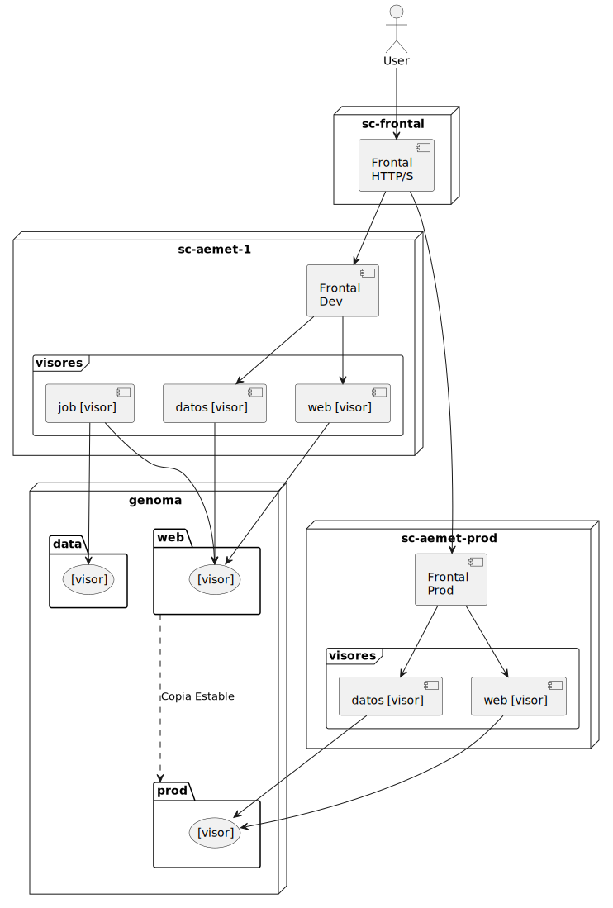

= Entorno de Ejecución
Los visores se han desarrollado para que se use Docker y sus volumenes para servir tanto los datos como los propios visores.

== Vision General
Dentro de la infraestrucutra del LCSC se ha decidido usar un servidor NFS, llamado `genoma`, para almacenar todos los datos. Y ademas se tiene un ordenador frontal (`sc-frontal`) que es el que esta sirviendo de publicador web y securizador de las conexiones. Este frontal contacta con otros ordenadores que son los que sirve tanto las paginas html de los visores como los datos. Estos ordenadores contienen los servicios como Docker-Compose.

[.text-center]
.Vision General
 

=== sc-frontal
Este nodo, solo tiene un apache funcionando y es el que realiza las rediecciones pertinentes y *aplica la seguridad (SSL y Autenticacion)*

[source,apache]
.apache.conf
----
RewriteEngine on
RewriteRule ^/etm-dev$ /etm-dev/ [R] <1>
...
    <Location "/etm-dev/"> <1>
        AuthType Basic
        AuthName "Restricted Content"
        AuthUserFile [AuthFile]
        Require valid-user
        ProxyPass "http://sc-aemet-1:8090/etm-dev/"
    </Location>
...
    <Location "/etm/"> <2>
        AuthType Basic
        AuthName "Restricted Content"
        AuthUserFile [AuthFile]
        Require valid-user
        ProxyPass "http://sc-aemet-prod:8090/etm/"
    </Location>
----
<1> Ejemplo para el visor ETM
<2> Lo mismo para la version prod

=== sc-aemet-1
Este nodo ejecuta los jobs que crean los artefactos y publica los diferentes servicios de cada visor.

Tiene un compoente 'Frontal Dev' que algutina todos los visores y los publica mediante HTTP. Es un 'nginx' que hace proxy reverso

[source,yaml]
.docker-compose.yaml
----
version: "3.9"
networks:
  sc-net: <1>
    name: sc-net
    driver: bridge
include: <2>
  - docker-compose.etm.yaml
    ...
volumes:
  sc-nc: <3>
    driver_opts:
      type: "nfs"
      o: "addr=genoma,bg,soft,nolock"
      device: ":[ruta]/data"

services:
  frontal-server: <4>
    image: nginx:alpine
    ports:
      - 8090:80
    restart: unless-stopped
    volumes:
      - ./frontal.conf:/etc/nginx/conf.d/default.conf
    networks:
      - sc-net
    depends_on:
      - etm-web-server
      - etm-artifacts-server
        ...
----
<1> Primero se define una red para poder comunicar todos los servicios
<2> Cada visor tiene su propio 'docker-compose.yaml' para facilitar la legibilidad
<3> El volumen de datos de entrada se define en este fichero y esta usado por los jobs.
<4> el servicio frontal algutinador, que como se puede ver esta publicado en el 8090 y depende del resto de servicios.

Por su parte cada visor tiene un Yaml similar al de ETM.

[source,yaml]
.docker-compose-etm.yaml
----
volumes:
  etm-artifacts:
    driver_opts: <1>
      type: "nfs"
      o: "addr=genoma,bg,soft,nolock"
      device: ":[ruta]/web/etm"
services:
  etm-job: <2>
    image: lcsc-r:latest
    volumes:
      - [Ruta Scripts etm]/etm.R:/data/etm.R:ro
      - [Ruta Scripts etm]/functions.R:/data/functions.R:ro
      - sc-nc:/data/nc:rw <3>
      - etm-artifacts:/data/out:rw <3>
    command: Rscript /data/etm.R
    #command: ls /data
      
  etm-artifacts-server: <4>
    image: nginx:alpine
    # ports:
    #   - 8091:80
    restart: unless-stopped
    volumes:
      - etm-artifacts:/usr/share/nginx/html:ro <4>
    networks:
      - sc-net

  etm-web-server: <5>
    image: lcsc-viewer-extreme-temperature-monitor:build <5>
    # ports:
    #   - 8092:80
    restart: unless-stopped
    networks:
      - sc-net
----
<1> Cada visor crea un volumen propio con una conexion NFS a su propio almacen
<2> El job es el encargado de procesar los NetCDF procesados y se encargan de generar el times.js y las versiones chunkeadas (en tiempo y espacio) de los mismos.
<3> Si nos fijamos utiliza el volumen de los datos y tambien el del propio visor por que luego el servicio lo publicara
<4> Servicio nginx que publica los artefactos generados por el job.
<5> Este servicio se genera desde el codigo del visor. Creando una imagen Docker. La imagen dev se crea de la rama main.

=== sc-aemet-prod
Para la version productiva, los ficheros son similares pero atendiendo a las siguientes caracteristicas:

* En genoma hay una copia de la carpeta web, con los artefactos generados (y los nc-descargables)
** Tanto para prod, como para proto-1
* No tiene los Jobs (ya han sido generados)
Las imagenes docker se generan de otras ramas
** Para la version Prod, las imagenes se generan de la rama stable
** Para la version Proto, las imagenes se generan de la tag proto-1

== Imagenes Docker
Se utilizan varias imagenes docker, simplificadas a dos tipo, la imagen de R y las imagenes de los visores

=== LCSC-R
Dentro del repositorio `MachineScripts` esta la carpeta `DockerImages/R_DevContainer`, con un DockerFile que genera una imagen de R compatible con DevContainers y todas las librerias que necesitamos. 

Ejecutar el commando:
[source,bash]
----
docker build . -t lcsc-r:latest \
 --build-arg VARIANT=4.3 \
 --build-arg BASE_IMAGE=r-ver \
 --build-arg HDF5_BRANCH=chunk_functions \
 --build-arg NCWEBMAPPER_BRANCH=the_chunk_way
----

Una vez que termine nos habra generado la imagen docker que requieren los Jobs para genera los artefactos.

=== Imagenes de los visores.
En el repositorio de los visores hay `Dockerfile` que permite la generacion de una imagen docker de un visor. El resultado es un nginx al que se le inyecta en el docker build la carpeta dist del visor.

Dicha imagen tiene 3 parametros para poder generar cada visor y algunas variantes:

* *NODE_VERSION* Por defecto `18-alpine`, es el node que se utiliza para generar la carpeta dist del visor.
* *ENVIRONENT* Por defecto `build` Es el commando de construccion que se ejecutara, solo pueden ser `build`, `build-wms` o `prod`.
* *VIEWER* Obligatorio, la carpeta del visor a generar.

Es posible hacer un 'docker build . --build-arg ...' pero para facilitar las cosas se ha creado un script `build.sh` que facilita la creacion de las imagenes. Para cada visor crea dos tags `[latest]` y `[git version]`

[source,bash]
.ejemplos
----
./build.sh -a # crea todas las imagenes version desarrollo
./build.sh -v fire-risk-index # crea solo las imagenes de fire-risk-index version desarrollo
./build.sh -a -e prod # crea todas las imagenes version produccion (ofuscadas)
./build.sh -v fire-risk-index -e prod # crea solo las imagenes de fire-risk-index version produccion (ofuscadas)
----

Cuando se regenere una imagen (o todas) es necesario relanzar los servicios

== Jobs
Todos los jobs siguen el mismo esquema y lo que hacen es construir un DataFrame con el listado de ficheros necesario y para cada fichero se realizan los siguientes pasos:

. Creacion del chunk temporal (solo si los datos son nuevos)
. Creacion del bin temporal (solo si el chunk temporal es nuevo)
. Creacion del chunk XY (solo si los datos son nuevos)
. Creacion del bin temporal (solo si el chunk XY es nuevo)
. Preparacion estructura Times.JS (Siempre)

Finalmente se crea el times.js

[source,R]
.etm.R
----
source('data/functions.R')

# Common cfg
...

ncVars <- data.frame("var"=c("tmax","tmin"),
                    "file"=c("tmax_daily_grid","tmin_daily_grid"),
                    "join"=c(TRUE,TRUE))

ncVars <-rbind(ncVars,data.frame("var"="heat_wave","file"="heatwave.nc","join"=FALSE))
...

info_js <- NaN

nVars <- dim(ncVars)[1]
for (nc in 1:nVars)  {
  el = ncVars[nc,]
  out_file=paste0(el$file,all_suffix)
  if(el$join){
    print (paste0("Uniendo ",el$file,pen_suffix," + ",el$file,can_suffix," -> ",out_file))
    join_pen_can(nc_root=nc_route,
              pen_file=paste0(el$file,pen_suffix),
              can_file=paste0(el$file,can_suffix),
              all_file=paste0(el$file,all_suffix))
  }else{
    out_file=el$file
  }
  print (paste0("Procesando: ",el$var," desde el fichero ",out_file))
  info_js <- generate_etm_artifacts(nc_route,
                                  out_route, out_file,
                                  el$var, max_zoom,
                                  epsg, info_js, FALSE)
}

title <- "ETM"
....

# Generamos el fichero time.js
print ("End: times.js")
result <- writeJs(
  folder = out_route, infoJs = info_js, title = title,
  varNames = var_names, varTitle = var_title,
  legendTitle = legend_title, projection = projection
)
#nc_dates(365)
print("Done")
----

== Utilidades
* *launch_jobs.sh*: Este comando instuye a docker para crear los contenedores y ejecutar todos los jobs. Ojo, la maquina solo tiene memoria para procesar 1 job de chunkeo. Para lanzar un solo job se le pasa como parametro el visor: `./laun_jobs.sh etm`
* *launch_services.sh*: Este comando instuye a docker para crear los contenedores y ejecutar todos los servicios HTTP (tanto su aglutinador como de los servicios). Como el anterior sin parametros reinicia todos y con parametro solo en indicado. Hay que ejecutarlo si se regeneran las imagenes de los visores.
* *buildFrontalConf.sh*: Este script genera la configuracion nginx del servicio aglutinador, se ejecuta `./buildFrontalConf.sh > frontal.conf`. Si se añade algun visor o hay que hacer algo en la configuracion

